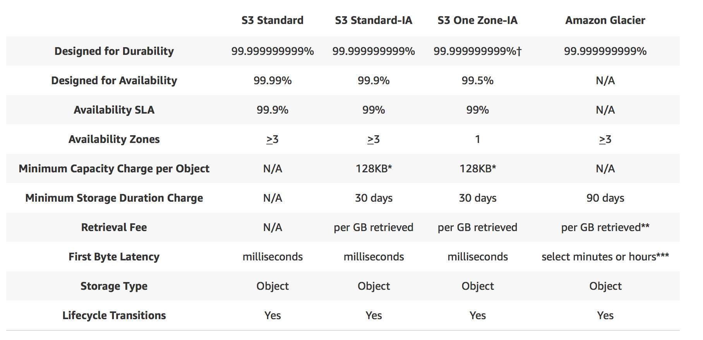

One of the first AWS services to be made available. Very important topic for all AWS certifications. 

Object based storage to store files, pictures, videos and text. Doesnt include operating system/ database etc. Operating system etc would be stored in block based storage. Databases have separate services depending on the database type.

Data is spread across multiple devices and facilities.

Files can be 0 bytes to 5 Terabytes in size.

Storage is unlimited and stored in buckets. Buckets are nothing but folder inside the cloud. Buckets have universal namespace and must be globally unique.

S3 URLs have a format of - [region-name].amazonaws.com/[bucket-name]

When you upload a file to S3, a HTTP code of 200 is returned to indicate that file upload was successful

## Data Consistency Model of S3

1. Read after Write consistency for PUTs of new Objects - If a new file is uploaded and read immediately, we will be able to read the contents of the file.

2. Eventual consistency for overwrite PUTS and DELETES - If a cloud is updated and read immediately the file may take a while to be updated and the updated version to be returned. A few milliseconds of latency is to be expected.

S3 is Object based. Objects consist of 
1. a key - name of the object. 
2. a value - simply the data contained in the file
3. version ID - versioning
4. Metadata - data about the data being stored. Such as tags etc
5. Access Control Lists - User groups who may or may not have access. These apply to individual files.
6. Torrent - Torrenting
7. Bucket policies - Bucket level policies

S3 is built for 99.99% availability for S3 platform.
Amazon Guarantee 99.9% availability
Amazon Guarantees 99.99999999% durability - This means that the file will never be lost

S3 has a tiered storage, depending on how often it is needed.

1. S3 Standard - 99.99% availability. 99.(nine 9s)% durability. Stored redundantly across multiple devices in multiple facilities and is designed to sustain the loss of 2 facilities concurrently.

2. S3 - IA (Infrequently Accessed) - For data that is accessed less frequently, but requires rapid access when needed. Lower fee than S3, but retrievals are charged. Redundant across multiple devices and facilities like S3 Standard.

3. S3 One Zone - IA: Lower cost than IA but is not replicated across multiple zones.

4. Glacier - Very cheap but used only for archival. Two types - Expedited, Standard and Bulk. Expedited takes few minutes, Standard takes 3-5 hours and bulk takes upto 12 hours to retrieve.

5. S3 Reduced Redundancy Storage - Less redundancy than standard

## Comparison of different S3 storage classes

## S3 Storage Charges

* Storage
* Requests
* Storage Management Pricing
* Data Transfer Pricing
* Transfer Acceleration

Transfer Acceleration enables fast, easy and secure transfer of files over long distances between end users and S3 bucket. Takes advantage of CloudFront's globally distributed edge locations. As data arrives at an edge location, data is routed to S3 over an optimized network path.

Data Transfer Pricing is the cost to transfer data in/out and across different regions

Storage Management Pricing is the price attached to items such as tags on S3 buckets which facilitates ease of management

Storage is charged per GB

Number of requests made to access the storage is also charged

## S3 Versioning

Once versioning is enabled, it cannot be disabled. It can only be suspended. Very big files might increase storage costs if versioning is turned on, since each version of the file will be stored.

MFA Delete can be enabled to add another layer of security to stop people from accidentally deleting buckets from S3.

When an object is deleted, a delete marker is added and the file is hidden from view. To undelete the file, the delete marker can be deleted which will bring back the file.

## Cross Region Replication

This is used to replicate contents of one bucket to another bucket in a different region.

Versioning must be enabled on both buckets to use Cross Region Replication.

CRR only applies to new objects added to the bucket and will not affect existing items inside the bucket.

A file deleted in one bucket will also be deleted in the other bucket.

But if a delete marker is deleted on one bucket, the delete marker is not replicated. The delete marker will have to be independently deleted on both buckets.

Similarly reverts will not be replicated.

Regions must also be unique. CRR cannot be enabled within the same region.

## Lifecycle Management

This is used when certain operations need to be performed on the objects inside S3 depending on when the object is created etc.

It can be used in conjunction with versioning.

It can be applied to current versions and previous versions.

For example - To move an object from Standard to IA, 30 days after creation. And to archive it to glacier 30 days after IA.

## Security and Encryption

All new buckets are private by default

Setup Access control using bucket policies at bucket level or with Access Control lists on the object level.

S3 buckets can be configured to create access logs which log all requests made to S3 bucket.

* Encryption in transit is through SSL/TLS

* Encryption at Rest
1. Client Side Encryption
2. Server Side Encryption with Amazon S3 Managed Keys
3. Server Side Encryption with KMS (Key Management Service)
4. Server Side Encryption with Customer Provided Keys

Managed keys are further encrypted by AWS and the keys are regularly rotated by AWS

* Client Side Encryption must be created by the client

## Transfer Acceleration

Transfer Acceleration utilises the CloudFront Edge Network to accelerate uploads to S3. Instead of uploading directly to S3 bucket, it uses a distinct URL to upload directly to an edge location which will then transfer to S3 across AWS backbone network.

Transfer Acceleration is enabled from S3 bucket properties after the bucket is created.

This is not included in any of the exams yet.

## Static Website hosting on S3

Static websites can be hosted on S3. 

The URL is [bucketname].s3-website-[region].amazonaws.com